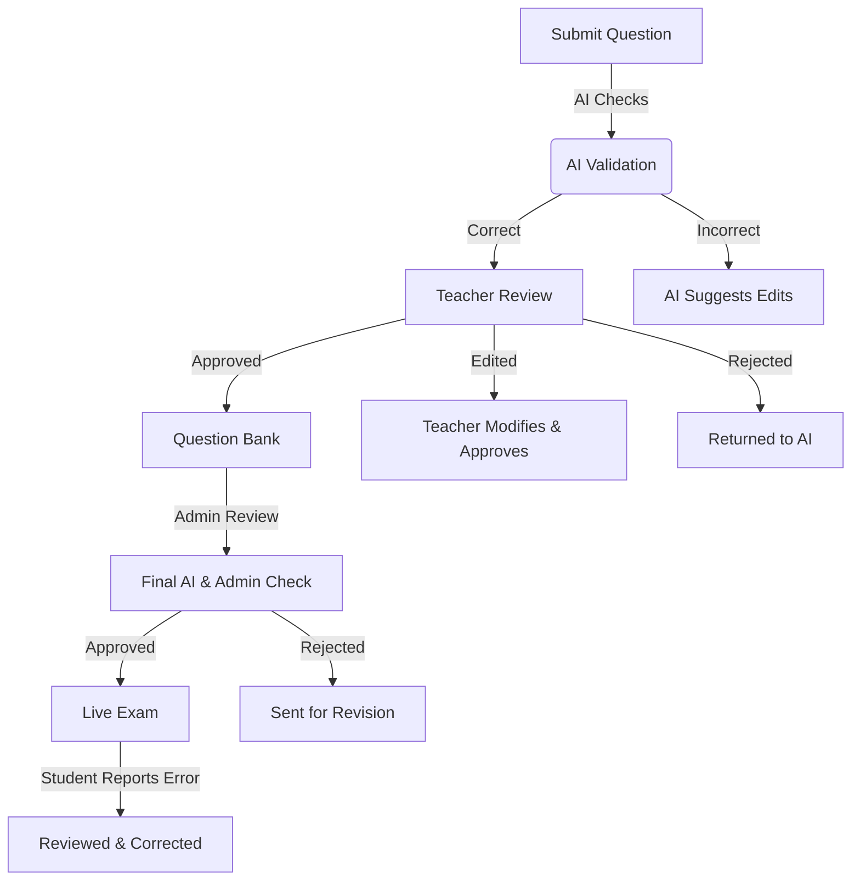

# PrepX - Free & AI-Powered Competitive Exam Platform

## 🌟 Overview
PrepX is a **lightweight and AI-powered** competitive exam platform designed for **JEE, NEET, Banking, CMAT, CUET, GPAT, and UGC NET** preparation. This platform uses **only free and open-source tools**, making it accessible for all developers and students. The system provides **mock test management, user authentication, performance tracking, and AI-based question generation & validation**.

🚧 **This project is in active development, and contributions are welcome!**

---

## 🔹 Features & Functionality

### ✅ **User Authentication & Role-Based Access**
- Secure login and registration using **JWT with Clerk.dev (Free Plan)**.
- Role-based access for **students, teachers, and admins**.

### ✅ **Mock Test & Exam Management**
- Teachers can **create, edit, and verify** mock tests.
- Students can **attempt MCQs and True/False questions**.
- Timed test sessions with **auto-submission**.

### ✅ **AI-Powered Question Generation & Validation**
- Multi-layered validation system:
  - **Layer 1**: AI-based validation for accuracy, grammar, plagiarism, and formatting
  - **Layer 2**: Teacher review and approval
  - **Layer 3**: Admin oversight for final validation
- Student reporting system for incorrect questions

### ✅ **Performance Tracking & Leaderboards**
- Track progress with **free data visualization tools**.
- **Dynamic leaderboards** to rank students based on exam scores.

### ✅ **Deployment & Hosting (Free Services)**
- **Frontend**: Hosted on **Netlify (Free Tier)**.
- **Backend**: Hosted on **Render (Free Tier)**.
- **Database**: **Supabase (Free Plan)** with PostgreSQL.

---

## 🔹 Supported Examinations

| Exam Name  | Purpose  | Mode  | Duration  | Question Format  | Marking Scheme  |
|------------|---------|------|----------|-----------------|-----------------|
| **JEE Main** | B.E./B.Tech Admission | CBT | 3 hours | MCQs & Numerical | +4/-1 |
| **NEET-UG** | MBBS/BDS Admission | Pen & Paper | 3h 20m | MCQs | +4/-1 |
| **CUET** | UG/PG Admission | CBT | Varies | MCQs | Varies |
| **CMAT** | MBA Admission | CBT | 3 hours | MCQs | +4/-1 |
| **GPAT** | M.Pharm Admission | CBT | 3 hours | MCQs | +4/-1 |
| **UGC NET** | Assistant Professor/JRF | CBT | 3 hours | MCQs | +2/-0 |

---

## 🔹 Technology Stack (Free & Open-Source)

| Component     | Free Alternative Used   |
|--------------|----------------------|
| Frontend     | React (Vite) + Tailwind CSS |
| Backend      | Express.js (Node.js) |
| Database     | Supabase (PostgreSQL) |
| Authentication | Clerk.dev (Free Tier) |
| AI Features  | Hugging Face API (Free Alternative to OpenAI) |
| Hosting      | Netlify (Frontend) & Render (Backend) |

---

---

## 🔹 Multi-Layered Question Validation System
### **Layer 1: AI-Based Validation**
- AI scans for **accuracy, grammar, plagiarism, and formatting**.
- Suggests corrections before sending to teachers.

### **Layer 2: Teacher Review**
- Teachers approve, edit, or reject AI-validated questions.
- Modified or approved questions move to the question bank.

### **Layer 3: Admin Oversight**
- Final validation by **admins and AI recheck**.
- Ensures **accuracy, fairness, and variety** before live deployment.

### **Student Reporting System**
- Students can report **incorrect questions**.
- Reported questions are **reviewed, corrected, or removed**.

---

## 🔹 Workflow Diagram


---

## 🔹 Database Schema (PostgreSQL via Supabase)

### Users Table (students, teachers, admins)
```sql
CREATE TABLE users (
    id UUID PRIMARY KEY DEFAULT gen_random_uuid(),
    name TEXT NOT NULL,
    email TEXT UNIQUE NOT NULL,
    password TEXT NOT NULL,
    role TEXT CHECK (role IN ('student', 'teacher', 'admin')) NOT NULL,
    created_at TIMESTAMP DEFAULT now()
);
```

### Tests Table (Mock Tests)
```sql
CREATE TABLE tests (
    id UUID PRIMARY KEY DEFAULT gen_random_uuid(),
    title TEXT NOT NULL,
    description TEXT,
    duration INT NOT NULL,
    created_by UUID REFERENCES users(id)
);
```

### Questions Table
```sql
CREATE TABLE questions (
    id UUID PRIMARY KEY DEFAULT gen_random_uuid(),
    test_id UUID REFERENCES tests(id),
    question_text TEXT NOT NULL,
    question_type TEXT CHECK (question_type IN ('MCQ', 'True/False')) NOT NULL,
    options TEXT,
    correct_answer TEXT,
    validation_status TEXT DEFAULT 'pending',
    teacher_approval_status TEXT DEFAULT 'pending',
    admin_approval_status TEXT DEFAULT 'pending'
);
```

### Results Table (Student Scores)
```sql
CREATE TABLE results (
    id UUID PRIMARY KEY DEFAULT gen_random_uuid(),
    user_id UUID REFERENCES users(id),
    test_id UUID REFERENCES tests(id),
    score FLOAT,
    completed_at TIMESTAMP DEFAULT now()
);
```

---

## 🔹 Implementation & Backend Logic
| Step  | Description  |
|--------|------------|
| **1. Submission** | Questions stored in `questions_pending_review` |
| **2. AI Validation** | Runs checks & updates `validation_status` |
| **3. Teacher Review** | Updates `teacher_approval_status` |
| **4. Admin Check** | Marks question as `approved` or `rejected` |
| **5. Live Deployment** | Moves approved questions to `questions_live` |
| **6. Student Reports** | Flagged questions are reviewed & updated |

---

## 🔹 Installation Guide

### Prerequisites
- Node.js & npm installed
- Supabase account (for free database hosting)
- Netlify & Render accounts (for free hosting)
- Clerk.dev account (for free authentication)
- Hugging Face account (for free AI API)

### Setup Instructions
1. **Clone the Repository**
   ```bash
   git clone https://github.com/yourusername/prepx.git
   cd prepx
   ```

2. **Install Dependencies**
   ```bash
   npm install
   ```

3. **Configure Environment Variables**
   - Create a `.env` file with your API keys:
   ```env
   SUPABASE_URL=your_supabase_url
   SUPABASE_ANON_KEY=your_supabase_anon_key
   CLERK_SECRET_KEY=your_clerk_secret_key
   HUGGINGFACE_API_KEY=your_huggingface_api_key
   ```

4. **Start the Development Server**
   ```bash
   npm run dev
   ```

---

## 🔹 Free Deployment Guide

### **Frontend Hosting (Netlify - Free Tier)**
1. Sign up at [Netlify](https://www.netlify.com/).
2. Connect the GitHub repository and deploy.

### **Backend Hosting (Render - Free Tier)**
1. Sign up at [Render](https://render.com/).
2. Deploy your **Express.js backend** from GitHub.

### **Database (Supabase - Free Tier)**
1. Sign up at [Supabase](https://supabase.io/).
2. Use PostgreSQL database for storing test and user data.

---

## 🔹 Legal Considerations
- **Compliance:** Adheres to the upcoming **Digital India Act** and follows **NITI Aayog's Responsible AI Principles**.
- **Intellectual Property:** No copyrighted content is used. All questions are AI-generated or teacher-verified.
- **Data Privacy:** Complies with **Digital Personal Data Protection Act 2023** to secure user data.

---

## 🔹 Future Enhancements
- **Use GPT-4 alternatives on Hugging Face for advanced AI validation**.
- **Integrate Machine Learning for improved accuracy**.
- **Gamify Teacher/Admin Reviews with leaderboards**.
- **Enable Peer Reviews where multiple teachers validate a question**.

---

## 🔹 License & Contributions
This project is licensed under the MIT License. Feel free to contribute and improve the platform.

---

## 🔹 Disclaimer & User Responsibilities
- AI-generated questions are for **practice purposes only**.
- The system **does not guarantee 100% accuracy**.
- Users should **cross-check** information and **follow institutional guidelines**.

---

## 🔹 Contact Information
For inquiries, reach out via **neelpatelcoc2gmail.com** or open an issue in the repository.

---

🚀 **PrepX - Free AI-Powered Exam Platform is now available for exam preparation!**
